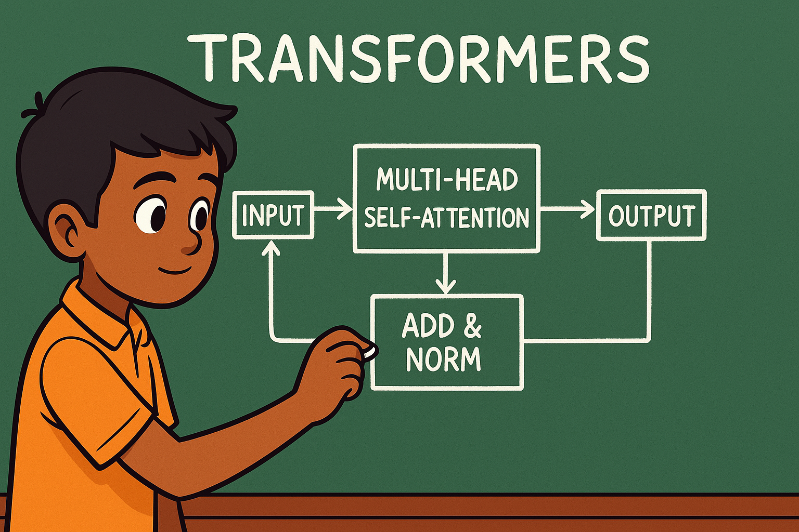

# 🚀 gemma-3-270M – Pure PyTorch Reimplementation

[](https://colab.research.google.com/drive/1E1X_CRyFvpdU4rSSk-BoYB9jkIfp4zDK?usp=sharing)


<p align="center">
  
  
</p>

<p align="center">
    
    (img credit ChatGPT)
</p>


**gemma-3-270M**, built entirely in **PyTorch** — a beginner-friendly implementation designed to enhance model understanding for future AI researchers. 

Without Inheriting from anything other than `nn.Module` 😁


---

## ✨ Features

* **Pure PyTorch** – No heavy dependencies beyond PyTorch & Hugging Face utilities.
* **RMSNorm** and **Rotary Position Embeddings**.
* **Custom Attention** – supports eager.
* **Easy to Modify** – great for research and teaching.
* In **Pytorch**
---


## 📦 Installation

```bash
git clone https://github.com/vedantdere/gemma-3-270m-pytorch.git
cd gemma-3-270m-pytorch
```

---
## Model Configurations

We provide three predefined model configurations:

1. **gemma-3-270M** – 270M parameter variant (`GEMMA3_270M`)

---

## 🚀 Quick Start

```python
import torch
from config import GEMMA3_270M
from layers import Gemma3Model  # your main file

# 1. Load Config
config = GEMMA3_270M()

# 2. Load Model
model = Gemma3Model(config)

# 3. Define Inputs
batch_size = 2
seq_len = 5 # for small model testing
input_ids = torch.randint(0, config.vocab_size, (batch_size, seq_len))
attention_mask = torch.ones(batch_size, 1, seq_len, seq_len)
position_ids = torch.arange(seq_len).unsqueeze(0).repeat(batch_size, 1)  # shape: [batch_size, seq_len]

# 4. Run forward pass
logits = model(input_ids=input_ids, attention_mask=attention_mask,position_ids=position_ids,use_cache=False)

print("Input IDs shape:", input_ids.shape)
print("Logits shape:", logits.shape)  # (batch_size, seq_len, vocab_size)
```

---

## 🧠 Key Design Choices

* **Modular** – Every component (attention, MLP, norm, router) is a standalone class.
* **Readable** – Code avoids excessive abstraction for clarity.
* **Custom Attention Backend** – Can integrate with flash attention or other kernels.

---

## 📊 Simple Training Script

```python
from torch.optim import AdamW

optimizer = AdamW(model.parameters(), lr=3e-4)
loss_fn = torch.nn.CrossEntropyLoss()

for step in range(100):
    logits = model(input_ids=input_ids)
    loss = loss_fn(logits.view(-1, config.vocab_size), input_ids.view(-1))
    loss.backward()
    optimizer.step()
    optimizer.zero_grad()
    print(f"Step {step}, Loss: {loss.item():.4f}")
```

----

## 🙏 Credits
Special thanks to the Hugging Face Transformers team for their exceptional open-source work. This Reimplementation is primarily inspired by Hugging Face Transformers integration but presented in a much simpler, more beginner-friendly way for easier understanding. 
Special thanks to Google Deepmind for opensourcing Gemma3-270M.

## 🙌 Inspiration

This work draws significant inspiration from Andrej Karpathy’s minGPT.


---

## 🤝 Contributing

Pull requests, bug reports, and feature suggestions are welcome!
If you improve the architecture or add new routing strategies, please share them with the community.

---

## 🌟 Star the Repo

If you find this project useful, please ⭐ it on GitHub – it helps more people discover it.